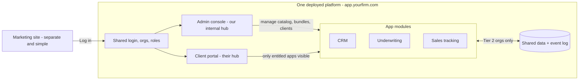

# Platform Architecture Proposal

*Draft for partner discussion — nothing here is final. Edit freely or leave comments.*

## What we're deciding

The firm wants to sell software applications to clients. The ideas on the table:

1. A **hub of all our projects** — the "engine" that holds everything, with partner access
   controlled by role in the firm.
2. **Tier 1 (standard):** a client buys a bundle of apps and gets one login that opens
   their own hub, from which they reach each app.
3. **Tier 2 (premium):** same bundle, but the apps share data — e.g., sales comps entered
   in an underwriting deal automatically populate a cumulative sales-tracking app.
4. **Custom copies:** for a premium, copy a base app and tailor it to a specific client.
5. The open question: should the hub be a purely **internal tool** where we assemble and
   bundle, which then "ships" apps to a separate customer-facing site — or one system?

## Recommendation in one paragraph

Build **one platform with two faces**, not an internal tool that ships to a separate site.
A single deployed web application contains: a shared login system, an **admin console**
(the internal hub — only staff can see it), a **client portal** (each client's hub), and
the apps themselves as **modules** inside the platform. "Shipping" an app to a client is
not copying code anywhere — it's flipping a switch (an *entitlement*) that makes the app
appear in that client's portal. Tier 2 is another switch that turns on data-sharing
between the modules a client owns. This gives you everything in the idea list with one
codebase, one database, and one thing to deploy and operate — which matters enormously,
because realistically the firm has about one and a half developers.

The only genuinely separate thing is the **marketing site** (how clients find and buy
services). That can be a simple site on Webflow/Framer/plain HTML with a "Log in" button
pointing at the platform. It needs none of this machinery.

## Why not "internal tool → ship to another site"

The two-system version means building: the internal hub, the customer site, and a
pipeline that packages apps out of one and installs them into the other. That pipeline is
the hardest of the three and delivers zero client-visible value. Every bug fix would have
to be re-shipped to every client copy. With a small team this collapses under its own
maintenance weight within months.

The instinct behind the idea is right, though: **internal controls and client experience
should be strictly separated.** We get that separation with roles and permissions inside
one platform (staff see `/admin`, clients see their portal), not with two systems.

## The shape

## Core concepts

| Concept | Meaning |
|---|---|
| **Organization** | A tenant. The firm itself is a staff org; every client is a client org. All data rows carry an `org_id` — that's what keeps clients isolated from each other. |
| **Member + role** | A user belongs to an org with a role. Staff roles: owner, admin, operator, viewer. Client roles: admin, member. One login system serves both. |
| **App module** | One of our products (CRM, underwriting, …). Lives in this codebase as a module with its own screens and tables, behind shared auth. Looks independent to the client. |
| **Catalog** | The admin-console list of all modules we offer, with pricing metadata. |
| **Bundle** | A named set of apps (e.g., "Acquisitions Starter" = CRM + Underwriting). |
| **Entitlement** | The record that says "client org X has access to app Y (at tier Z)." The portal renders exactly the entitled apps. This *is* the product delivery mechanism. |
| **Domain event** | When something notable happens in a module ("comp saved on deal 12"), it writes an event to a shared log. Other modules can subscribe. |
| **Customization layer** | Per-org settings: branding, custom fields, feature flags. How we sell "custom copies" without forking code. |

## Tier 1 vs Tier 2 — a pricing switch, not two architectures

Because every module already lives on the same platform and database, the "master engine"
doesn't need to be a separate system. It's the event log plus subscriptions:

1. Underwriting module: user saves sales comps on a deal → module writes its own data
   **and** publishes `comp.recorded` events.
2. Sales-tracking module subscribes to `comp.recorded` → adds the comp to the client's
   cumulative tracker.
3. The subscription only runs for orgs with the **integration tier** flag on.

So Tier 1 clients get independent apps under one login; Tier 2 clients get the same apps
with the data flows switched on. Upgrading a client is a settings change, not a
migration. And if some app ever truly must live elsewhere, the internal event log can be
mirrored out as webhooks — the design has a growth path without starting there.

## "Copying base models" — the customization ladder

Forked copies of a codebase are how tiny teams die: five clients on five forks means
every fix is applied five times. Sell customization as a ladder instead, priced by rung:

1. **Branding/theme** — client colors, logo, domain. Pure config.
2. **Custom fields & terminology** — per-org field definitions ("we call deals
   'engagements'"). Config, no code.
3. **Feature flags** — turn module features on/off per org. Config.
4. **Extension points** — client-specific logic at defined hooks (custom report, custom
   calculation), kept in one folder per client in the same repo.
5. **True fork** — last resort, only if a client pays enough to fund permanently divergent
   maintenance. Priced like a bespoke build, because it is one.

Rungs 1–3 cover most "premium custom copy" sales and cost us almost nothing marginal.

## Partners, Claude accounts, and access by firm role

The shared source of truth is a **GitHub organization** owned by the LLC, with this repo
(and any future ones) inside it. Each partner keeps their **own GitHub account and own
Claude account** — Claude Code operates on the shared org repos, so everyone's work lands
in one place regardless of whose Claude subscription did it. A `CLAUDE.md` in the repo
gives every partner's Claude sessions the same project context and conventions. (If we
later want shared claude.ai chat Projects and centralized billing, a Claude Team plan
does that — not required to start.)

Access by place in the firm then has two layers:

| Person | Firm role | GitHub org role | Platform staff role |
|---|---|---|---|
| You | Managing partner, lead dev | Owner | Owner |
| Intern partner | Partner, developer | Member (write) | Admin |
| New partner | Partner, non-technical | Member (read/triage) | Operator (manage clients & bundles, no code) |
| Professor | Advisor | Outside collaborator (read) | Viewer |

Plus branch protection on `main` (PRs required), 2FA required org-wide, and no secrets
committed to the repo — ever.

## Suggested stack (held loosely until the questions below are answered)

Optimize for what the coding partners already know:

- **If JavaScript/TypeScript:** Next.js (one app serving admin + portal + modules),
  Postgres (Neon or Supabase — managed, backed up), Drizzle or Prisma, a managed auth
  library (Better Auth / Auth.js / Clerk), deployed on Vercel or Render.
- **If Python:** Django — its built-in admin gives us a big head start on the internal
  hub, same Postgres setup, deployed on Render/Railway/Fly.

Either way: **one deployable app, one managed Postgres database**, row-level tenancy by
`org_id`, an `audit_log` table from day one (B2B clients ask), Stripe later when billing
is real. Roughly $0–50/month until there's real traffic.

## Phased plan — the massive version is the destination, not the starting point

Each phase ends with something a real client could use.

- **Phase 0 — Foundations.** Login, organizations, roles, admin console skeleton, and the
  **CRM as the first module**, end to end. *Done when one pilot client logs in and uses
  the CRM for real work.*
- **Phase 1 — Catalog & bundles.** Second module, app catalog, entitlements, the client
  portal hub page. *Done when a client sees exactly the apps in their bundle and nothing
  else.* (Tier 1 now exists.)
- **Phase 2 — Integration tier.** Event log + first cross-module flow (underwriting comp
  → sales tracker), gated by the tier flag. *Done when flipping the flag for one org
  makes data flow.* (Tier 2 now exists.)
- **Phase 3 — Customization layer.** Per-org theming, custom fields, feature flags.
  *(The "premium custom copy" offering now exists.)*

Onboard the first clients by hand — no self-serve signup, no automated billing. Sell
manually, automate what hurts.

## Deliberately not building now

- A separate customer-facing product or an app-shipping pipeline (covered by entitlements).
- Microservices / separately deployed apps (modules give the same boundaries at 1/10 the cost).
- Self-serve signup and payments (manual onboarding first).
- Automated code-forking for custom clients (the ladder replaces it).

## Open questions for the partners

Answers to these change the design, so they come before code:

1. **First client & first apps.** Who realistically is the first paying client, and which
   apps do they need? The examples (underwriting, sales comps, cumulative sales tracking)
   sound like commercial real estate — what are the first three modules, concretely? Is
   the CRM one of them?
2. **Tier 2's first data flow.** Which specific piece of data flowing from which app to
   which app would a client pay extra for first? (This defines the shared entities.)
3. **How custom is "custom"?** For the premium copies: branding + custom fields + toggled
   features, or genuinely different logic per client? What's the most extreme
   customization we'd ever promise?
4. **Coding capacity & stack.** Is it just you writing code, or you + the intern partner?
   What do you each already know (JS/React? Python? neither)? The stack should follow
   that answer.
5. **Client shape.** Do client companies bring multiple users (teams) or is it one person
   per client? Will any client demand their data be fully separated from other clients'
   (some firms do — affects tenancy design)?
6. **Data sensitivity.** Will these apps hold financials or personal data that would make
   a client's IT/security team ask questions (security reviews, SOC 2)? Not urgent, but
   it argues for managed auth + audit logs from the start.
7. **Money & time.** Comfortable with ~$50/month hosting? When do you want a pilot client
   using Phase 0 — this semester, this year?
8. **Operations.** Who answers when a client is locked out at 9pm? (Determines how much
   self-service and admin tooling to build vs. handling things manually.)
