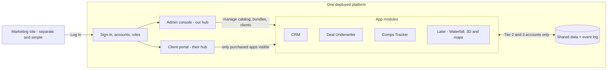

# Platform Architecture — Decisions and Plan

*v2, updated July 2026 after partner Q&A. The first draft's open questions are now
decisions. Still a living doc — edit freely.*

## The big decision (unchanged from v1)

Build **one platform with two faces**, not an internal tool that ships apps to a separate
customer site. A single deployed web application contains: a shared sign-in system, an
**admin console** (our internal hub — staff only), a **client portal** (each client's
hub), and our apps as **modules** inside the platform. Giving a client an app means
flipping a switch that makes it appear in their portal — no copying code anywhere.
The marketing site (how clients find us) stays separate and simple: a page with a
"Log in" button.

## What we sell: three tiers

| Tier | What the client gets | Under the hood |
|---|---|---|
| **1 — Standard** | Their bundle of apps, one login, their own hub page | App switches per account |
| **2 — Integrated** | Same apps, but data flows between them automatically | The platform's event log connects their apps |
| **3 — Custom** | Integrated, plus tailoring: their branding inside the apps, custom fields, changed behavior | The customization layer (below), priced per project on top of the subscription |

**Concrete Tier 2 example (the first one we'll build):** a client underwrites a deal in
the Deal Underwriter and enters the sales comps that justify the value. On Tier 1, if
they also own the Comps Tracker app, they'd have to retype those comps into it. On
Tier 2, the comps show up in their Comps Tracker automatically the moment they're saved.
Same apps — the platform just moves the data. Enter once, use everywhere.

More flows on the same machinery as the catalog grows: a deal finished in the
Underwriter feeds the Equity Waterfall's assumptions; a comp entered anywhere gets
pinned on the map automatically; a property's details feed its 3D massing view. Every
new flow is another switch on the same event log — never a new system.

## Accounts: solo and group

Every client gets an **account**, and an account can hold one person or a whole team:

- **Group account:** the main person (the account owner — e.g., the boss) signs in,
  invites teammates by email, chooses which of the account's apps each person can open,
  and removes people when they leave. **Data belongs to the account, not the person:**
  in shared-data apps, everyone on the account works on the same data (comps entered by
  an analyst show up for the boss).
- **Solo account:** exactly the same thing with one seat. Nothing separate to build, and
  a solo client upgrades to a team just by inviting someone.
- Per-seat pricing is possible later (e.g., three seats included, $X per extra seat).

A third *account type* isn't needed — the "third tier" is the **Custom pricing tier**
above, which any account, solo or group, can buy.

Hard rule the platform enforces everywhere: **one account can never see another
account's data.**

## Signing in

The flow we'll offer clients:

1. Email (or username) + password.
2. First time on a new computer or browser: a one-time code by text message. The device
   is remembered after that, so the code isn't asked for every day.
3. Phone: verify once on first sign-in, then trusted.
4. Forgot password: self-service reset by email — clients fix their own lockouts instead
   of calling us.

We will **not** build sign-in ourselves — login and account security are the most
dangerous things to hand-build. A managed sign-in service (Clerk) provides all four
behaviors, plus the invite-your-team flow, out of the box. Text codes cost about a penny
each. Later, security-minded clients can switch to an authenticator app.

## The app catalog

**Starter three (confirmed):** aimed at commercial real estate, with commercial-style
residential fitting the same shapes:

1. **CRM** — contacts, companies, properties, and a deal pipeline. Useful to every client
   type; this repo's namesake.
2. **Deal Underwriter** — purchase price, income and expenses, NOI, cap rate, a simple
   rent roll, and the sales comps used to justify value.
3. **Comps Tracker** — the account's cumulative, searchable database of sales comps
   across all their deals.

First integration flow (the Tier 2 showcase): **comp saved in the Underwriter → appears
in the Comps Tracker.**

**Next up (partner-led):**

4. **Equity Waterfall** — GP/LP splits, preferred return, promote tiers, IRR hurdles,
   distribution schedules. Pairs naturally with the Underwriter: on integrated
   accounts, a deal's numbers feed the waterfall's assumptions automatically.
5. **3D Building & Maps** — start with what sells and ships: properties and comps
   plotted on interactive maps, then simple 3D massing views of a building on its
   parcel. A full 3D modeling tool is the most technically ambitious item in the
   catalog — grow into it in stages rather than promising CAD on day one.

A module is the unit of ownership: once the platform skeleton exists, any partner can
build a module end to end with their own Claude account — sign-in, accounts, theming,
and data isolation come from the platform for free.

## Phones vs computers: one platform, sized to the device

Not two separate apps. The platform is one responsive web app that resizes to the
screen, and clients can install it on a phone home screen so it opens and feels like an
app — no app store involved. What differs by device is the *experience per module*:

| Module | On a computer | On a phone |
|---|---|---|
| CRM | Full pipeline | Full — built for use in the field |
| Comps Tracker | Entry and analysis | Quick lookup and photo capture |
| Deal Underwriter | The full tool | Read-only deal summary |
| Equity Waterfall | The full tool | Read-only distribution summary |
| 3D Building & Maps | Full maps and 3D | Maps yes; 3D viewing only |

Separate App Store / Play Store apps are deliberately later: they would double the work
for a small team, and everything above works in the browser. Revisit only if clients
demand push notifications or offline use.

## Custom work — changing an app for one client without copying it

Decisions:

- **Theming is built in from day one.** Every screen reads its logo and colors from
  account settings. Default is our brand; Tier 3 clients get theirs. (Cheap to build
  now, painful to retrofit later.)
- **Changing how an app works for one client never means copying the app.** Every client
  runs the same base app; the differences live in per-account settings the base app
  reads:
  - **Feature switches** — parts of an app turned on or off per account.
  - **Custom fields and wording** — their extra fields, their terminology.
  - **Extension points** — for genuine behavior changes, the base app has defined
    moments where it asks "does this account have custom logic here?" and runs it. Each
    client's custom pieces live in one clearly-marked folder in this same repo. When we
    improve the base app, **every client gets the improvement automatically**, and their
    customizations ride along untouched — which is exactly the "change it without
    changing the base app" requirement.
  - A fully separate copy is the last resort, priced like a bespoke build — because
    that's what it becomes.

## The data we'll hold, and how it's protected

What these apps will store: property addresses and photos, purchase prices and deal
terms, rent rolls, income and expense statements, cap rates and comps, pipeline notes,
and client teams' names, emails, and phone numbers. Residential work may add tenant
names and contact info (personal data). Nothing heavily regulated (no health or card
data), but all of it is confidential business information, so these defaults are on from
day one: encrypted managed database with daily backups, strict account separation,
text-code sign-in, and an audit log (who did what, when). This is what a client's IT
person wants to hear, and it costs us almost nothing because managed services provide it.

**Uploaded documents.** Clients will upload confidential files — rent rolls, T-12s,
offering memos, leases. Rules from day one: files live in private, encrypted storage
(never a public bucket) and belong to the client's account like any other data; a file
is only reachable through short-lived links the platform hands to signed-in members of
that account; uploads are limited by file type and size; every view and download lands
in the audit log. Virus scanning gets added when upload volume justifies it.

## The stack (decided)

Chosen for a team whose coding is AI-assisted — both developers are new to code — so the
priority is the most mainstream tools with the most guardrails, where the dangerous
parts are managed services rather than our own code:

- **Next.js + TypeScript** — one app serving the admin console, client portal, and all
  modules. The most widely documented web stack there is.
- **Clerk** — sign-in, group accounts and invites, text codes, remembered devices.
- **Neon Postgres + Drizzle** — managed database, backups included.
- **Vercel** — hosting, with a staging environment and a production environment.
- **Stripe** — later, when billing is real.

Roughly $0–75/month until there's real traffic. Every service account gets created under
the LLC (a shared LLC email), never under someone's personal email.

## How we'll build (guardrails for an AI-assisted team)

- All changes go through Claude Code on this repo via pull requests — nobody edits the
  live site directly.
- `CLAUDE.md` holds the conventions so every partner's sessions build the same way.
- Each app module has one owning partner; the platform core (sign-in, accounts, data
  isolation) changes only by agreement between the developing partners.
- Staging is where we try things; clients only ever touch production.
- Never test with a real client's data.
- The account-separation rule gets automated tests before anything else does.

## Phases — each ends with something a real client could use

- **Phase 0 — Foundations.**
  *Setup (partners):* create the LLC's GitHub organization and move this repo into it;
  create Vercel, Clerk, and Neon accounts under the LLC; buy the domain when named.
  *Build:* sign-in, accounts and roles, admin console skeleton, and the **CRM module end
  to end.* Done when one pilot client logs in and uses the CRM for real work.*
- **Phase 1 — Catalog and bundles.** Second module, the app catalog, per-account app
  switches, the client portal hub page. *Done when a client sees exactly the apps they
  bought and nothing else.* (Tier 1 exists.)
- **Phase 2 — Integration.** The event log and the comps flow (Underwriter → Comps
  Tracker), turned on per account. *Done when flipping the switch for one account makes
  data flow.* (Tier 2 exists.)
- **Phase 3 — Customization layer.** Per-account theming, custom fields, feature
  switches, first extension point. (Tier 3 exists.)

Onboard the first clients by hand — no self-serve signup, no automated billing. Sell
manually, automate what hurts.

## Deliberately not building now

- A separate customer-facing product or an app-shipping pipeline (the app switches cover it).
- Separately deployed apps/microservices (modules give the same boundaries at a tenth the cost).
- Self-serve signup and payments.
- Automated code-copying for custom clients (the customization layer replaces it).

## Still open (none of these block Phase 0)

1. Product name and domain (a placeholder is fine to start).
2. Price points for the three tiers — business decision for the partners.
3. Create the LLC-owned GitHub organization and set each partner's access there.
